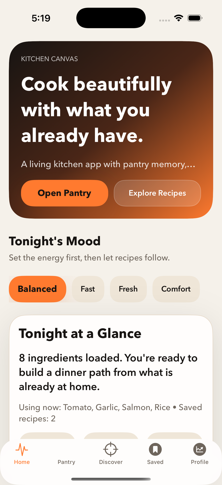
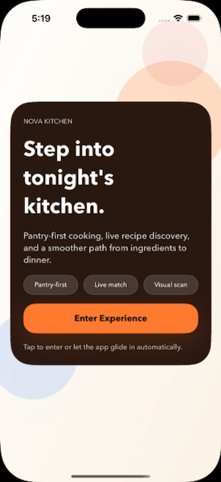

# Fudget

Fudget is a redesigned iOS cooking app built around a simple idea: help people cook better meals from the ingredients they already have at home.

The app now opens with a dedicated landing experience, then moves into a modern pantry-first workflow with recipe discovery, scanner support, saved recipes, and a lightweight wellness/profile view.

## Preview



## Demo Video

[](docs/fudget-demo.mp4)

The demo video is also available directly at [docs/fudget-demo.mp4](docs/fudget-demo.mp4).

## What The App Does

- Starts with a cinematic landing page and smooth transition into the app shell.
- Lets users build a pantry by typing ingredients, pasting lists, or scanning with the camera.
- Organizes pantry items visually with category summaries and quick actions.
- Finds recipes from live ingredients using the Spoonacular API.
- Ranks recipe results by pantry fit, speed, and search filters.
- Shows detailed recipe pages with ingredients, steps, timing, and save/share actions.
- Keeps saved recipes in a dedicated cookbook-style screen.
- Tracks a simple BMI snapshot inside the profile flow.

## Main Screens

- `Home`: hero dashboard, mood filters, quick actions, curated picks, and summary cards.
- `Pantry`: pantry workspace for adding, scanning, searching, sharing, and clearing ingredients.
- `Discover`: live recipe feed with pantry match scoring and mode-based browsing.
- `Saved`: saved recipe library with search.
- `Profile`: BMI and kitchen summary view.

## Stack

- Swift
- UIKit
- AVFoundation
- Vision / Core ML
- Alamofire
- SwiftyJSON
- SDWebImage
- IQKeyboardManagerSwift
- CocoaPods

## Running The Project

1. Install dependencies:

```bash
pod install
```

2. Open the workspace:

```bash
open Fudget.xcworkspace
```

3. If needed, set a Spoonacular API key in `Info.plist` as `SPOONACULAR_API_KEY`.

4. Build and run the app in Xcode.

## Demo / Showcase Launch Arguments

These launch arguments are useful for simulator demos:

- `-seedShowcaseData`
  Seeds the app with pantry items, saved recipes, and a BMI snapshot.
- `-demoTour`
  Seeds showcase data and automatically walks through the main app flow for recording.

Example:

```bash
xcrun simctl launch booted com.nithish.Fudget -demoTour
```
